# Codex Anime Pets

Tiny chibi companions for the Codex desktop app. These fan-made anime pets were generated from chibi / pixel-pet interpretations of anime and game characters I like, then packaged as Codex-compatible `pet.json + spritesheet.webp` folders.

<p align="center">
  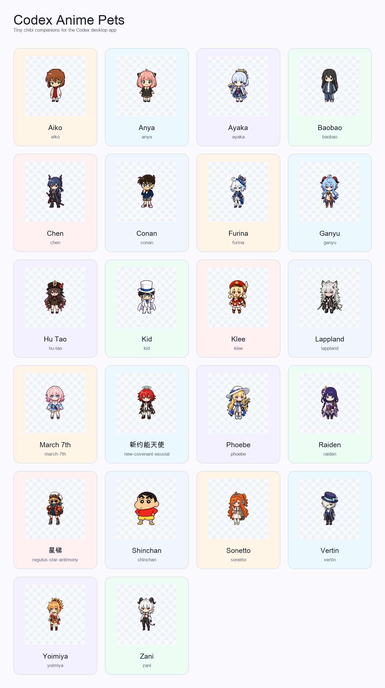
</p>

## Download

The easiest way is to grab the latest ZIP from [Releases](https://github.com/chenxin-dlut/codex-anime-pets/releases/latest).

Clone the repo, then copy any pet folder into your local Codex pets directory:

```bash
git clone https://github.com/chenxin-dlut/codex-anime-pets.git
mkdir -p ~/.codex/pets
cp -R codex-anime-pets/pets/hu-tao ~/.codex/pets/
```

To install every pet:

```bash
cp -R codex-anime-pets/pets/* ~/.codex/pets/
```

Each folder contains:

- `pet.json` - Codex pet metadata.
- `spritesheet.webp` - the 8 x 9 Codex pet animation atlas.

## Pet Gallery

Every pet includes a quick preview and a full contact sheet showing the animation rows.

| Pet | Preview | Package | All frames |
| --- | --- | --- | --- |
| **Aiko**<br><sub>`aiko`</sub> | 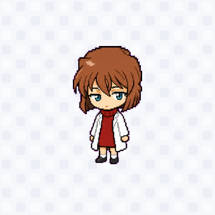 | [download folder](pets/aiko/) | [contact sheet](assets/contact-sheets/aiko.png) |
| **Anya**<br><sub>`anya`</sub> | 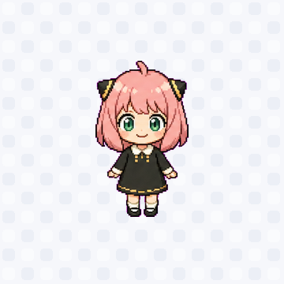 | [download folder](pets/anya/) | [contact sheet](assets/contact-sheets/anya.png) |
| **Ayaka**<br><sub>`ayaka`</sub> | 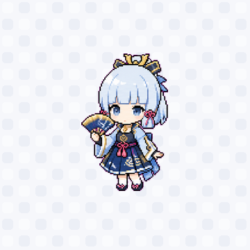 | [download folder](pets/ayaka/) | [contact sheet](assets/contact-sheets/ayaka.png) |
| **Baobao**<br><sub>`baobao`</sub> | 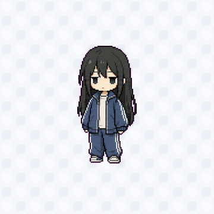 | [download folder](pets/baobao/) | [contact sheet](assets/contact-sheets/baobao.png) |
| **Chen**<br><sub>`chen`</sub> | 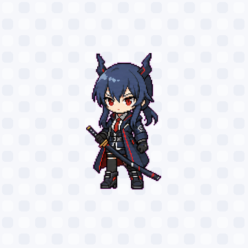 | [download folder](pets/chen/) | [contact sheet](assets/contact-sheets/chen.png) |
| **Conan**<br><sub>`conan`</sub> | 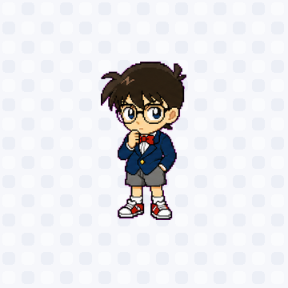 | [download folder](pets/conan/) | [contact sheet](assets/contact-sheets/conan.png) |
| **Furina**<br><sub>`furina`</sub> | 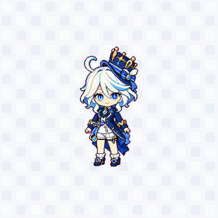 | [download folder](pets/furina/) | [contact sheet](assets/contact-sheets/furina.png) |
| **Ganyu**<br><sub>`ganyu`</sub> | 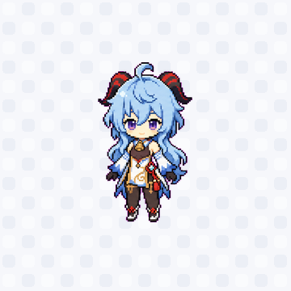 | [download folder](pets/ganyu/) | [contact sheet](assets/contact-sheets/ganyu.png) |
| **Hu Tao**<br><sub>`hu-tao`</sub> | 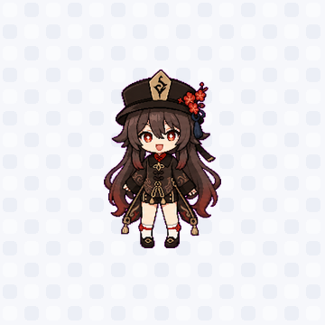 | [download folder](pets/hu-tao/) | [contact sheet](assets/contact-sheets/hu-tao.png) |
| **Kid**<br><sub>`kid`</sub> |  | [download folder](pets/kid/) | [contact sheet](assets/contact-sheets/kid.png) |
| **Klee**<br><sub>`klee`</sub> | 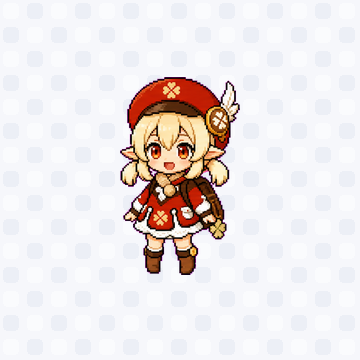 | [download folder](pets/klee/) | [contact sheet](assets/contact-sheets/klee.png) |
| **Lappland**<br><sub>`lappland`</sub> | 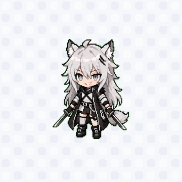 | [download folder](pets/lappland/) | [contact sheet](assets/contact-sheets/lappland.png) |
| **March 7th**<br><sub>`march-7th`</sub> | 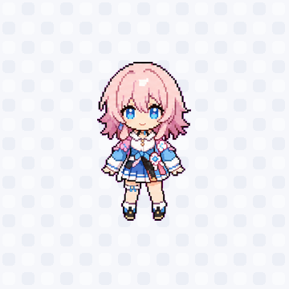 | [download folder](pets/march-7th/) | [contact sheet](assets/contact-sheets/march-7th.png) |
| **新约能天使**<br><sub>`new-covenant-exusiai`</sub> | 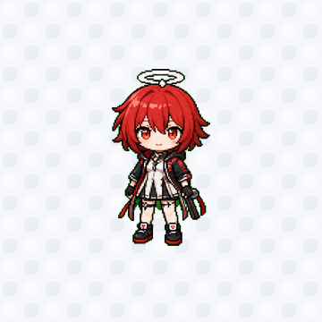 | [download folder](pets/new-covenant-exusiai/) | [contact sheet](assets/contact-sheets/new-covenant-exusiai.png) |
| **Phoebe**<br><sub>`phoebe`</sub> | 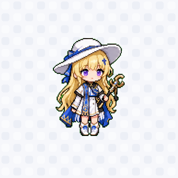 | [download folder](pets/phoebe/) | [contact sheet](assets/contact-sheets/phoebe.png) |
| **Raiden**<br><sub>`raiden`</sub> | 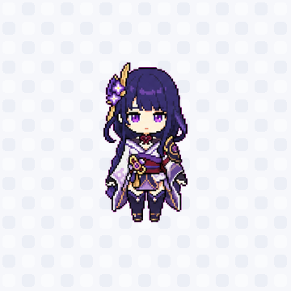 | [download folder](pets/raiden/) | [contact sheet](assets/contact-sheets/raiden.png) |
| **星锑**<br><sub>`regulus-star-antimony`</sub> | 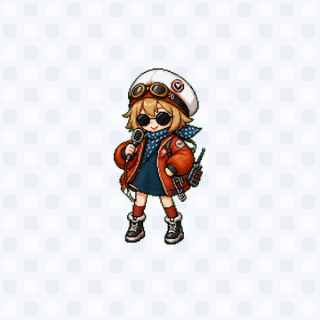 | [download folder](pets/regulus-star-antimony/) | [contact sheet](assets/contact-sheets/regulus-star-antimony.png) |
| **Shinchan**<br><sub>`shinchan`</sub> | 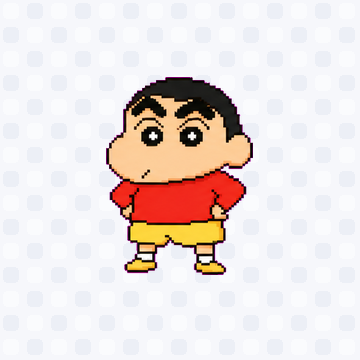 | [download folder](pets/shinchan/) | [contact sheet](assets/contact-sheets/shinchan.png) |
| **Sonetto**<br><sub>`sonetto`</sub> | 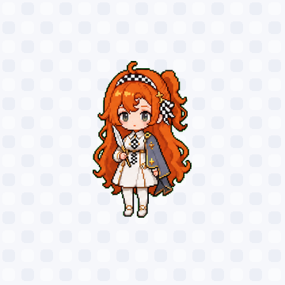 | [download folder](pets/sonetto/) | [contact sheet](assets/contact-sheets/sonetto.png) |
| **Vertin**<br><sub>`vertin`</sub> | 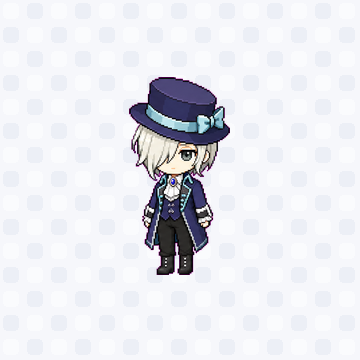 | [download folder](pets/vertin/) | [contact sheet](assets/contact-sheets/vertin.png) |
| **Yoimiya**<br><sub>`yoimiya`</sub> | 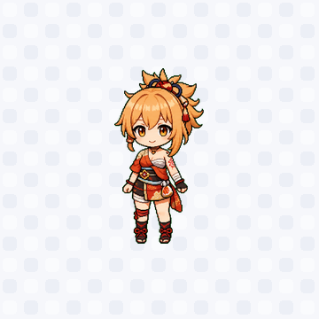 | [download folder](pets/yoimiya/) | [contact sheet](assets/contact-sheets/yoimiya.png) |
| **Zani**<br><sub>`zani`</sub> | 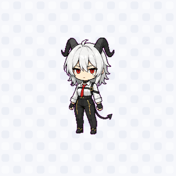 | [download folder](pets/zani/) | [contact sheet](assets/contact-sheets/zani.png) |

## Compatibility

The included spritesheets follow the current Codex pet atlas layout:

- `1536 x 1872` WebP atlas.
- `8 x 9` grid.
- `192 x 208` pixels per cell.
- Transparent unused cells.

All included atlases pass the deterministic validation script from the local `hatch-pet` workflow.

## Build Preview Assets

The pet packages are the source of truth. Preview images in `assets/` can be rebuilt from the packaged spritesheets:

```bash
python tools/build_previews.py
```

The contact sheets were generated from the same spritesheets with the local `hatch-pet` tooling.

## Copyright And Fan-Content Notice

Short version: yes, there can be copyright / trademark risk because many pets are inspired by recognizable third-party anime or game characters. A disclaimer is useful, but it is not a magic shield.

This repository is an unofficial, non-commercial fan collection. The sprites here are generated chibi/pixel-pet reinterpretations and do not include official source art files. Character names, original designs, trademarks, and related copyrights belong to their respective owners. This project is not affiliated with, sponsored by, or endorsed by any rights holder.

The assets are shared for personal, non-commercial use as Codex desktop pets. If you are a rights holder and want something removed, please open an issue or contact the repo owner and it will be handled promptly.

See [LICENSE.md](LICENSE.md) for the split between repository code/docs and fan-art assets.
